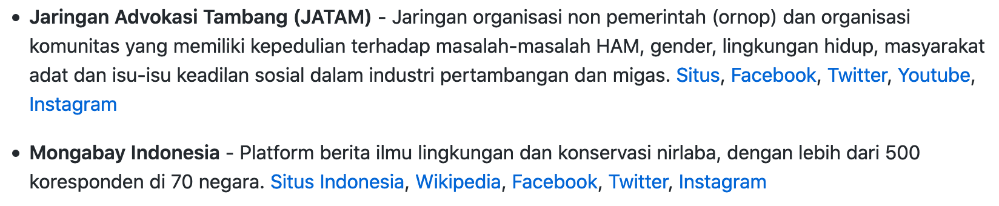

# Kontribusi

>**Sebelum mulai berkontribusi mohon baca halaman ini sampai tuntas**.  
Peraturan bisa berubah, mohon kunjungi halaman ini secara berkala.

## Pertanyaan dan Jawaban

**P:** Apa kategori khusus atau cara membedakan sesuatu boleh dimasukkan ke daftar kurasi atau tidak?

**J:** Bisa menggunakan logika dan hati kamu, kalau pun dibuat mungkin hasilnya akan seperti berikut :

- Organisasi publik yang terbuka, bukan yang anggotanya hanya internal instansi atau perusahaan tertentu, terkecuali memang sangat diakui hasil kerja dan pengaruh positifnya terhadap lingkungan, yang dari sana kita bisa mendapatkan banyak konten edukatif.

- Bukan merupakan program Tanggung Jawab Sosial Perusahaan (TJSP), terkecuali organisasi independen yang transparan/teraudit yang menerima TJSP dari banyak perusahaan.

- Bukan merupakan organisasi yang melaksanakan atau pendukung perdagangan karbon (*carbon trading*) atau perdagangan emisi.

- Organisasi dengan konten publik yang baik, sejalan dengan aksi merawat bumi. Tidak ditunggangi oleh kepentingan tertentu dengan tujuan komersil, pencitraan, atau promosi, terhadap individu, perusahaan, atau bahkan kelompok tertentu yang diduga tidak sejalan dengan aksi menjaga lingkungan.

---

**P:** Saya ingin berkontribusi, kira-kira apa yang dapat saya lakukan?

**J:** Kamu bisa mengoreksi penulisan yang salah ejaan, tautan yang rusak atau telah diubah, urutan yang salah, penyebutan yang salah, dan yang utama menambahkan isi untuk daftar kurasi.

---

**P:** Bolehkan saya membuat usul, saran, atau memberi tahu kesalahan di daftar?

**J:** Tentu saja boleh, apapun itu untuk membuat daftar kurasi ini lebih baik dan lebih berguna. Misal, jika ada hal yang menurutmu perlu diajukan sebab belum ada, dan kamu rasa bagian itu perlu untuk ditambahkan, kamu sangat boleh mengajukannya. Boleh juga kalau kamu menemukan kesalahan, perubahan data, atau tautan yang rusak. Caranya bisa dengan membuat Github *issue* atau bisa hubungi langsung ke narahubung, yang ada di bagian bawah halaman ini. Untuk membuat isu kamu harus memiliki akun Github. Jika belum tahu cara membuat *issue* bisa baca di dokumentasi resminya di [*Creating an issue*](https://docs.github.com/en/free-pro-team@latest/github/managing-your-work-on-github/creating-an-issue)

---

**P:** Saya mau membantu lewat pengumpulan data tapi saya terbiasa dalam bentuk *spreadsheet*, apa boleh?

**J:** Untuk dukungan berupa data, boleh mengirimkan dalam format `.cls`, `.xlsx` atau apapun bentuk lainnya yang efektif dan memungkinkan. Nanti datanya akan digunakan untuk melengkapi daftar yang ada. Untuk alamat pengiriman data atau pertanyaan lanjutan seputar hal ini bisa hubungi narahubung yang tertera.

---

**P:** Bagaimana cara membuat deskripsi atau keterangan untuk tiap isi daftar kurasi?

**J:** Untuk menjaga kesesuaian, deskripsi bisa dikutip dari penjelasan di halaman resminya entah itu situs atau media sosial resminya, di halaman/bagian tentang atau mungkin bagian sejarah. Jika tidak ditemukan bisa menggunakan Wikipedia sebagai bantuan referensi. Untuk format penulisan bisa dengan hanya deskripsi, hanya slogan, atau penggabungan keduanya yang diawali slogan dan diakhiri keterangan deskriptif.

---

**P:** Tautan apa saja yang harus atau dianjurkan untuk dimasukkan ke tiap isi daftar kurasi dan bagaimana aturan penuliskan tautan-tautan yang ada?

**J:** Karena daftar ini memang sifatnya kurasi dari halaman-halaman peduli bumi yang tersebar di internet jadi tidak menutup kemungkinan untuk memasukkan banyak tautan resmi untuk tiap satu organisasi di daftar. Akan tetapi ada batasan yang diterapkan sehingga perlu di perhatikan, misalnya pada organisasi internasional yang punya banyak akun/halaman di suatu situs untuk mewakili tiap negara operasionalnya atau juga organisasi nasional yang punya banyak akun/halaman dari cabang-cabangnya untuk setiap daerah. Untuk hal semacam itu, untuk organisasi internasional pilih halaman versi Indonesia jika ada dan untuk organisasi nasional pilih halaman nasionalnya yang utama ketimbang halaman-halaman daerahnya. Hal tersebut berlaku untuk situs resminya maupun akun media sosial resminya.  
Kalau pun ada urutan yang yang sekarang digunakan yaitu **`Situs, Facebook, Twitter, Youtube, Instagram`** urutan ini bisa disusul dengan penambahan blog atau media sosial lainnya yang digunakan organisasi itu secara resmi, dapat juga dikurangi jika tidak ada akun/halaman resmi untuk situs-situs tersebut. Usahakan selengkap mungkin tapi dengan memperhatikan aturan yang ada.

Selanjutnya ada perbedaan penyebutan/penulisan yang dipakai untuk tautan ke situs resmi yang diletakkan di daftar kurasi, yang pertama disebut **`Situs`** untuk situs yang keseluruhan memang situs lokal bukan merupakan versi Indonesia dari situs internasional, yang kedua disebut **`Situs Indonesia`** yang menerangkan kalau itu situs versi Indonesia atau halaman khusus Indonesia dari situs organisasi internasional.

Gambar : contoh penulisan untuk organisasi internasional dan lokal yang sudah diatur dengan pembedaan penulisan situs resmi, juga pada namanya ditambahkan kata Indonesia sebagai akhiran untuk cabang atau versi Indonesia dari organisasi internasional.

---

## Aturan kontribusi langsung ke repositori Github

- Gunakan Bahasa Indonesia yang baik dan benar serta mudah dimengerti.

- Tidak mengubah gaya penulisan Markdown,  bisa merujuk ke <https://www.markdownguide.org/basic-syntax/> untuk panduannya. Jika menggunakan VS Code bisa menggunakan ekstensi ini untuk membantu proses *linting* <https://marketplace.visualstudio.com/items?itemName=DavidAnson.vscode-markdownlint>.

- Tidak membuat spam *pull request* yang bisa dikategorikan asal jadi dan banyak melanggar aturan kontribusi ini, jika terjadi maka akan diberi label **`spam`**.

- Untuk kesalahan ejaan atau perbaikan penulisan yang kecil kata silahkan membuat *issue*, jangan membuat *pull request* cuma untuk satu kalimat apalagi satu kata. *Issue* kecil seperti ini nanti akan digabungkan pengerjaannya dengan kerjaan lainnya sekaligus.

- Sangat hindari membuat *pull request* baru jika yang kamu buat sebelumnya belum selesai dan berubah status menjadi `closed` terkecuali ada kasus tertentu yang membuatnya menjadi perlu.  
Ingat untuk tiap `commit` baru di cabang (*branch*) git yang sama, kamu tidak perlu membuat pull request baru jika yang sebelumnya masih berstatus `open`, kamu hanya perlu melakukan git *push* lagi, bisa baca disini <https://github.community/t/do-i-need-to-make-a-new-pull-request-for-every-commit/13098>.

- Hanya membuat *pull request* yang mengarah ke cabang git `contribution` sebelum akhirnya di satukan ke `master` oleh ***maintainer***, jika sudah terbuat ke cabang lainnya kamu bisa mengeditnya.

- Kalau hendak membuat *issues* usahakan yang jelas, jangan asal. Bila perlu deskripsikan maksud mu secara lengkap, *issues* yang detail tidak akan menyusahkan, malah memperjelas dan membuat orang lain lebih mudah untuk menanggapinya, dan berefek kepada lebih cepatnya proses untuk diselesaikan, diputuskan, atau dipecahkan.

>**Mohon kerjasamanya agar daftar kurasi ini lebih baik dan lebih berguna.**

### Narahubung

Bila diperlukan dalam bentuk apapun terkait daftar kurasi ini, jangan ragu 24/7 silahkan kirim pesan pribadi ke salah satu kontak yang tertera di profil akun [Github saya](https://github.com/hafizkurniaaji).
